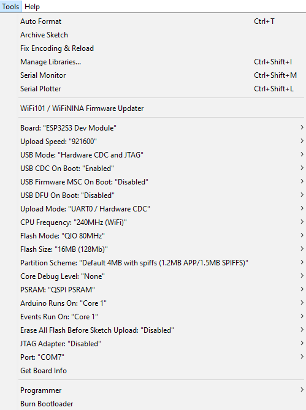

# NORVI X

**NORVI X** is a next-generation modular industrial IoT controller designed for modern automation applications.

## Overview

NORVI X is a flexible and modular industrial IoT controller suitable for both small projects and large factories.
NORVI X simplifies monitoring, control, and data acquisition, making deployment efficient and straightforward.

## Arduino IDE Configuration
To program the ESP32S3 microcontroller using the Arduino IDE, follow these steps:

**Board Configuration**  
- **Board:** ESP32S3 Dev Module  

## Required Setup Steps
For developing ESP32 firmware for Fire Alarm, Fault Alarm, and Mains Power Fail Monitoring & Notification System, ensure the following:

- **Arduino IDE Version:** 1.8.19
1. Connect your board via USB interface.  
2. Select the correct board and port:  
   - Go to: `Tools → Board → Boards Manager`  
3. Configure the upload method under the `Tools` menu.

## Required Libraries
Ensure the following libraries are installed with the correct versions for proper operation:

- Open Arduino IDE → `Sketch → Include Library → Manage Libraries...`  
- Search for the library name and install the mentioned version.  
- Alternatively, clone the repositories directly into your Arduino libraries folder.

## Upload and Board Details
Example configurations and details for uploading code to the ESP32S3:

### Upload Configuration

## Technical Highlights
- Modular and expandable design  
- Reliable industrial-grade hardware  
- Easy integration with sensors and actuators  

## Support
For technical support or additional documentation, please visit: [NORVI Support](https://norvi.io/contact-us/)

